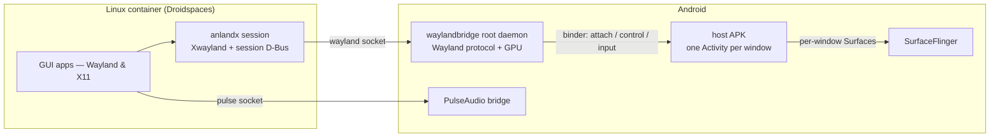

# Anland — a Wayland host for Android

**English** | [简体中文](README_CN.md)

Anland runs the graphical Linux apps of a container on a **rooted Android** device and shows each of them as a **native Android window** — its own entry in the app switcher, its own Surface, its own soft-keyboard focus. There is no virtual screen and no mirroring: every app gets a real window, and Android's own compositor keeps drawing the screen.

It ships as a SukiSU/KernelSU module (`anland-awl`): a root daemon, a host APK, the session inside the container, and an audio bridge. The companion launcher [anland-shell](https://github.com/SuperTurtleDev/anland-shell) manages the containers and starts the apps.

> [!IMPORTANT]
> **Branch status.** `main` is the active development branch — the refactored 6.x
> architecture. As a consequence of the rewrite it does not yet reach the feature
> completeness of 5.x: if you want stability and the full desktop experience, use
> the [`legacy`](https://github.com/SuperTurtleDev/anland/tree/legacy) branch
> (5.x) instead. 5.x stays in maintenance until 6.x catches up with the 5.x
> feature set (complete desktop, virtual keyboard, accessibility, …).
> Maintenance is bug fixes only — and only functional bugs that affect usage;
> intermittent glitches that a restart of the consumer app clears are out of
> scope.

**Why the rewrite?** 5.x exchanged frames over a private display protocol (the
"Anland Display Protocol"): every compositor — KWin, Weston, … — needed its own
adaptation backend written against that protocol, and each of those had to be
maintained separately. The 6.x refactor makes Wayland itself the frame-exchange
protocol, so stock compositors work unmodified and only the host side needs
maintaining.

## Why it is not a standard compositor

A standard Wayland compositor — Weston, Sway, a desktop session — takes over a machine's display: it owns the whole screen, composites every client into one output, reads input from evdev, and clients reach it through the `wayland-0` socket. On a phone that model degrades into "one fullscreen remote-desktop window". Anland keeps the protocol half of a compositor and replaces the display half with Android itself:

| | Standard compositor | Anland |
|---|---|---|
| Screen | Owns the display, composites everything into one output | Owns no display — Android's SurfaceFlinger keeps compositing |
| Windows | Internal window management inside a single output | Every `xdg_toplevel` becomes one real Android window (its own Activity and Surface) |
| Connection | A `wayland-0` unix socket file | No socket file — connections are fds passed over Android binder |
| Client identity | All clients are the same session user | Every client connects with its own uid; windows are owned per app |
| Input | evdev/libinput from DRM devices | Each window's Android touch/key/IME events, translated to Wayland |
| Lifecycle | A user session process | A root daemon in its own SELinux domain — not an app uid, so OEM "battery optimization" cannot freeze it |

What that design buys you:

- **Linux windows are first-class Android windows.** They appear in the app switcher, split-screen and behave like ordinary app windows — each with its own focus and its own IME state, candidates following the cursor.
- **Hidden windows park their clients.** With no Android surface attached, the daemon stops draining that window's buffers, so a minimized Linux app neither spins nor burns GPU frames.
- **Foreground apps are scheduled like foreground apps.** While a window is attached, its client's whole process tree is moved into Android's top-app cgroups — the Linux app in front of you is scheduled like any foreground Android app, not like a background daemon.
- **Sound included.** A PulseAudio bridge plays the container's audio through Android's own audio stack.
- **X11 apps included.** The in-container session runs a patched rootless Xwayland, so X11 apps show up as windows the same way Wayland apps do.
- **Real-device fixes the stock stack lacks.** A bubblewrap that survives KernelSU+SuSFS fake mount ids, and an Xwayland that does accelerated GL on Adreno GPUs (kgsl/turnip) — see `patches/`.
- **Any Android app can join in.** The `libawl` client library lets a third-party app connect over binder and host its own Wayland windows, scoped to that app's uid.

## How it fits together



The pieces:

- **`waylandbridge`** — the daemon: a single statically-linked ELF holding both the Wayland protocol side and the GPU renderer. It renders each window's frames directly into the Surface of that window's Android Activity.
- **Host APK (`com.anlandnext`)** — spawns one Activity per window, feeds it input, and provides the window list and settings UI.
- **`libawl`** — the client library (AAR) that third-party apps embed to host their own windows.
- **anlandx** — the session inside the container: links the daemon's socket, runs rootless Xwayland with a small X window manager, and publishes the app environment.
- **pulse** — PulseAudio for Android (OpenSL ES / AAudio sinks) so container apps have sound.
- **module** — the SukiSU/KernelSU packaging: boot service, SELinux domain, contexts generated at flash time from the device's live system files.

## Rendering backends: SC and EGL

The daemon composites each window through one of two backends, selected by
`sc_enabled` in the daemon config (`/data/adb/modules/anland-awl/config.json`,
default `1`; applied when a window attaches):

- **SC (SurfaceControl) — efficient, low overhead, scanout direct.** Every
  wayland layer becomes a SurfaceControl sibling and SurfaceFlinger/HWC does the
  compositing — the daemon composites nothing, and a client's dma-buf can be
  scanned out zero-copy on an HWC plane. The trade-off: surface *movement*
  responds more slowly, since positions land through SF transactions. Best for
  content whose surfaces mostly sit still — games.
- **EGL (GL renderer) — smooth movement, higher GPU usage.** A per-window GPU
  compositor samples every layer into one buffer and presents it through
  eglSwapBuffers. Surface movement is smooth, at the price of a GPU composite
  every frame. Best for scrolling content — web browsing.

## Requirements

- A rooted arm64 device (SukiSU or KernelSU)
- A Droidspaces Linux container
- The host APK installed — windows attach through it, and audio requires it

## Install

1. Get the three artifacts: `build/module/anland-awl.zip`, `build/anland-wayland.apk`, `build/anlandx.tar.gz` — build them (below) or take them from CI.
2. Flash the zip in your root manager and reboot. The daemon starts at boot (log: `/data/local/tmp/awl_daemon.log`).
3. Install `anland-wayland.apk`.
4. Inside the container, set up the session:

   ```sh
   tar xzf anlandx.tar.gz && bash anlandx/setupanlandx.sh
   ```

5. Manage containers and launch apps with [anland-shell](https://github.com/SuperTurtleDev/anland-shell).

## Starting the desktop

`anland-launch` — installed into `~/.local/bin` by `setupanlandx.sh` — is the
entry point. The session it needs is already running: `anland-session.service`
is a systemd *user* unit that comes up on login, links the daemon's socket into
the user runtime dir as `wayland-anland`, and publishes the app environment in
`~/.anlandx-env`.

```sh
anland-launch desktop          # the whole Plasma desktop, in ONE Android window
anland-launch desktop stop     # stop it again
anland-launch app <command>    # a single app, in its own Android window
anland-launch status           # what is running
```

The mode is chosen per client by which socket it connects to, so both can run at
once: in **desktop mode** KWin connects to anland and the apps inside it speak to
KWin; in **app mode** the app connects to anland directly.

The launcher also sets the environment the nested compositor needs — every entry
below is established by testing, not documentation:

| Variable | Why |
|---|---|
| `MESA_LOADER_DRIVER_OVERRIDE=msm` | the session exports `kgsl`, which breaks GBM/EGL here: EGL then reports no DRM node and KWin refuses to start |
| `KWIN_DISABLE_VULKAN=1` | Turnip lacks `VK_EXT_physical_device_drm`, which KWin needs to map a Vulkan device to a DRM node |
| `QT_QPA_PLATFORM=wayland` | Qt apps must take the Wayland platform plugin rather than XCB |
| `WAYLAND_DISPLAY=wayland-anland` | the daemon's socket, as linked into the user runtime dir |

Desktop mode starts `startplasma-wayland`, not a hand-rolled
`kwin_wayland` + `plasmashell`: the latter gets plasmashell SIGKILLed within
seconds while KWin survives (no OOM involved — `oom_score_adj` was -1000).

For a stock compositor to work unmodified, the daemon has to offer the protocols
KWin treats as hard requirements: `wl_compositor` ≥ v4, `zwp_linux_dmabuf_v1` ≥
v4 with `zwp_linux_dmabuf_feedback_v1`, `wp_single_pixel_buffer_manager_v1`,
`wp_presentation`, `wp_viewporter` (plus `wl_seat`,
`zwp_pointer_constraints_v1`, `zwp_relative_pointer_manager_v1`). `wl_output`
advertises the panel's real refresh rate and re-announces it when the rate or the
window size changes.

## Window settings

While a window is open, its behaviour is set on the host APK's settings screen
(`am start -n com.anlandnext/com.anlandnext.WlSettingsActivity` from a root
shell, or through anland-shell). Options marked *(daemon)* are stored by the
daemon in its own `config.json` and applied to windows configured from then on;
the rest are APK-local.

- **Screen mode** *(daemon)* — how the client canvas relates to the Android
  window. *Exact 1:1* (`canvas_w`/`canvas_h` = `-2`) makes the canvas the window,
  so the client renders one buffer pixel per panel pixel: never resampled, never
  cropped, and zoom has no effect on it. *Follow window / zoom* (`-1`) divides
  the window by the zoom, so the desktop fills the window at the requested size
  (a window wider than the zoomed canvas is cropped). *Desktop canvas* (a fixed
  size such as 1920x1080) configures every client for that canvas and fits it
  into the window with letterbox bars — the way to show a whole 16:9 desktop on
  a tall panel.
- **Edge inset** — reserves a band the height of the system status bar out of
  the surface, on the window's **long** axis: top and bottom in portrait, left
  and right in landscape. It keeps the client's own toolbar and the panel's
  rounded corners from overlapping; the surface shrinking is also what makes the
  client reflow.
- **On-screen touchpad** — use the window as a laptop pad: one finger moves the
  pointer, tap clicks, long-press-then-drag drags, two fingers scroll, two-finger
  tap right-clicks.
- **Shortcut key bar** — Esc, Tab, Ctrl, Alt, Shift, Super, arrows, Enter,
  Backspace. The modifiers latch: tap to hold, tap again to release.
- **IME display mode** — *inset* shrinks the surface so the client reflows above
  the keyboard; *overlay* lets the keyboard float over the content.
- **Renderer** *(daemon)* — `sc_enabled`: the SurfaceControl backend (zero-copy,
  HWC planes) or the EGL renderer (smoother surface movement, one GPU composite
  per frame).
- **Refresh rate** *(daemon)* — `refresh_hz`: `0` (default) detects the panel's
  offered rate at the current resolution and re-samples it when a window
  attaches; a positive value pins it.

## Build

Linux host with JDK 17, an Android SDK (`ANDROID_HOME` and `JAVA_HOME` set; missing pieces are auto-installed), plus meson/ninja/patch for the audio part.

```sh
git submodule update --init --recursive
make        # waylandbridge + host APK + module zip + anlandx tarball
```

CI builds every push/PR and uploads the artifacts.

## Related projects

- [anland-shell](https://github.com/SuperTurtleDev/anland-shell) — the launcher: container management and the app grid that drives all of this.

## License

GPL-3.0. Bundled third-party components (libwayland, PulseAudio, bubblewrap, Xwayland, …) keep their own licenses.
