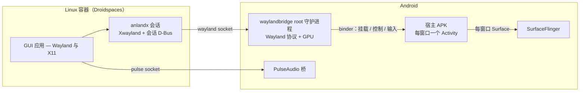

# Anland — Android 上的 Wayland 宿主

**简体中文** | [English](README.md)

Anland 在 **已 root 的 Android** 设备上运行 Linux 容器里的图形应用，并把每一个应用显示为一个**原生 Android 窗口**——在最近任务里有自己的卡片、有自己的 Surface、有自己的输入法焦点。没有虚拟屏幕，也没有画面镜像：每个应用拿到一个真正的窗口，屏幕仍由 Android 自己的合成器绘制。

它以 SukiSU/KernelSU 模块（`anland-awl`）的形式发布：一个 root 守护进程、一个宿主 APK、容器内的会话，以及音频桥。配套启动器 [anland-shell](https://github.com/SuperTurtleDev/anland-shell) 负责管理容器和启动应用。

> [!IMPORTANT]
> **分支状态。** `main` 是活跃开发分支（重构后的 6.x 架构）。由于重构，功能尚不及
> 5.x 完整：追求稳定和完整桌面体验请使用
> [`legacy`](https://github.com/SuperTurtleDev/anland/tree/legacy) 分支（5.x）。
> 5.x 会持续维护，直到 6.x 补齐 5.x 的功能（完整桌面、虚拟键盘、无障碍等）。
> 维护仅限 bug 修复——且只接受影响使用的功能性 bug；重启 consumer app 即可解决的
> 概率性小问题不在维护范围内。

**为什么重构？** 5.x 用一套私有显示协议（"Anland Display Protocol"）交换帧：每个合成器
——KWin、Weston……——都要针对该协议单独维护一套适配后端，维护成本高。6.x 的重构把帧
交换协议标准化为 Wayland 本身，原生合成器无需改动即可接入，只有宿主一侧需要维护。

## 它和标准合成器有什么不同

标准的 Wayland 合成器——Weston、Sway、桌面会话——接管整台机器的显示：独占整个屏幕、把所有客户端合成到一个输出、从 evdev 读取输入，客户端通过 `wayland-0` socket 连接。这套模型放到手机上就会退化成"一个全屏的远程桌面窗口"。Anland 保留了合成器的协议那一半，把显示那一半交还给 Android：

| | 标准合成器 | Anland |
|---|---|---|
| 屏幕 | 独占显示，把一切合成到单一输出 | 不持有任何显示——SurfaceFlinger 继续负责合成 |
| 窗口 | 在单一输出内部做窗口管理 | 每个 `xdg_toplevel` 变成一个真正的 Android 窗口（独立的 Activity 和 Surface） |
| 连接 | `wayland-0` unix socket 文件 | 没有 socket 文件——连接通过 Android binder 传递 fd |
| 客户端身份 | 所有客户端都是同一个会话用户 | 每个客户端以自己的 uid 连接；窗口按应用归属 |
| 输入 | 来自 DRM 设备的 evdev/libinput | 每个窗口的 Android 触摸/按键/输入法事件，翻译成 Wayland 事件 |
| 生命周期 | 一个用户会话进程 | 自有 SELinux 域的 root 守护进程——不是 app uid，厂商"省电优化"冻结不了它 |

这套设计带来的东西：

- **Linux 窗口是一等公民的 Android 窗口。** 出现在最近任务里、支持分屏、表现和普通应用窗口一致——各自持有焦点和输入法状态，候选框跟随光标。
- **隐藏的窗口会让客户端挂起。** 没有 Android surface 挂载时，守护进程停止消费该窗口的缓冲区，最小化的 Linux 应用既不空转也不烧 GPU 帧。
- **前台应用按前台调度。** 窗口挂载期间，客户端的整个进程树会被移入 Android 的 top-app cgroup——眼前的 Linux 应用按前台 Android 应用调度，而不是像后台守护进程那样被限速。
- **自带声音。** PulseAudio 桥把容器的音频经由 Android 自己的音频栈播放出来。
- **自带 X11。** 容器内会话运行打过补丁的 rootless Xwayland，X11 应用和 Wayland 应用一样以窗口形式出现。
- **真机问题真修复。** 能在 KernelSU+SuSFS 伪挂载 id 下存活的 bubblewrap，以及在 Adreno GPU（kgsl/turnip）上做硬件加速 GL 的 Xwayland——见 `patches/`。
- **任何 Android 应用都能加入。** 第三方应用通过 `libawl` 客户端库经 binder 连接，托管自己的 Wayland 窗口，权限按该应用的 uid 隔离。

## 组合起来是什么样



各组成部分：

- **`waylandbridge`**——守护进程：单个静态链接的 ELF，同时容纳 Wayland 协议侧和 GPU 渲染器。它把每个窗口的帧直接渲染进该窗口 Android Activity 的 Surface。
- **宿主 APK（`com.anlandnext`）**——每个窗口启动一个 Activity、喂入输入事件，并提供窗口列表和设置界面。
- **`libawl`**——客户端库（AAR），第三方应用嵌入后即可托管自己的窗口。
- **anlandx**——容器内的会话：链接守护进程的 socket、运行 rootless Xwayland 和一个小型 X 窗口管理器、发布应用环境。
- **pulse**——Android 版 PulseAudio（OpenSL ES / AAudio 输出），让容器应用有声音。
- **module**——SukiSU/KernelSU 模块封装：开机服务、SELinux 域、刷入时从设备活系统文件生成 contexts。

## 渲染后端：SC 与 EGL

守护进程以两种后端之一合成每个窗口，由守护进程配置（`/data/adb/modules/anland-awl/config.json` 的
`sc_enabled`，默认 `1`，窗口挂载时生效）决定：

- **SC（SurfaceControl）——高效、低占用、扫描直出。** 每个 wayland 图层成为一个
  SurfaceControl 兄弟层，由 SurfaceFlinger/HWC 负责合成——守护进程自己不合成，客户端的
  dma-buf 可以零拷贝直上 HWC 平面。代价是 surface *移动* 响应较慢：位置要经由 SF 事务
  落地。适合 surface 基本不动的场景——游戏。
- **EGL（GL 渲染器）——移动平滑、GPU 占用高。** 每窗口一个 GPU 合成器，把所有图层
  采样进一个缓冲区，经 eglSwapBuffers 呈现。surface 移动平滑，代价是每帧一次 GPU
  合成。适合滚动内容——网页浏览。

## 环境要求

- 已 root 的 arm64 设备（SukiSU 或 KernelSU）
- 一个 Droidspaces Linux 容器
- 已安装宿主 APK——窗口经由它挂载，音频也依赖它

## 安装

1. 取得三个产物：`build/module/anland-awl.zip`、`build/anland-wayland.apk`、`build/anlandx.tar.gz`——自己构建（见下）或从 CI 取。
2. 在 root 管理器里刷入 zip 并重启。守护进程开机自启（日志：`/data/local/tmp/awl_daemon.log`）。
3. 安装 `anland-wayland.apk`。
4. 在容器内搭建会话：

   ```sh
   tar xzf anlandx.tar.gz && bash anlandx/setupanlandx.sh
   ```

5. 用 [anland-shell](https://github.com/SuperTurtleDev/anland-shell) 管理容器、启动应用。

## 启动界面

`anland-launch` 是入口（由 `setupanlandx.sh` 安装到 `~/.local/bin`）。它依赖的会话已经
在运行：`anland-session.service` 是一个 systemd **用户**服务，登录时自动启动，把守护进程
的 socket 链接到用户运行时目录下的 `wayland-anland`，并把应用环境写入 `~/.anlandx-env`。

```sh
anland-launch desktop          # 整个 Plasma 桌面，装进一个 Android 窗口
anland-launch desktop stop     # 停止
anland-launch app <命令>        # 单个应用，拥有自己的 Android 窗口
anland-launch status           # 查看当前运行状态
```

模式由客户端连接哪个 socket 决定，因此两者可以同时运行：**桌面模式**下 KWin 连接
anland，桌面里的应用与 KWin 通信；**应用模式**下应用直接连接 anland。

启动器同时设置嵌套合成器所需的环境。下表每一项都是实测结论，不是文档抄来的：

| 变量 | 原因 |
|---|---|
| `MESA_LOADER_DRIVER_OVERRIDE=msm` | 会话导出的是 `kgsl`，而 `kgsl` 在这里会破坏 GBM/EGL：EGL 报没有 DRM 节点，KWin 拒绝启动 |
| `KWIN_DISABLE_VULKAN=1` | Turnip 缺少 `VK_EXT_physical_device_drm`，而 KWin 需要它把 Vulkan 设备映射到 DRM 节点 |
| `QT_QPA_PLATFORM=wayland` | 强制 Qt 应用使用 Wayland 平台插件而不是 XCB |
| `WAYLAND_DISPLAY=wayland-anland` | 守护进程的 socket 在用户运行时目录中的链接名 |

桌面模式启动的是 `startplasma-wayland`，而不是手工组合 `kwin_wayland` + `plasmashell`：
后者会让 plasmashell 在几秒内被 SIGKILL，而 KWin 存活（与内存无关，`oom_score_adj` 为
-1000）。

要让原版合成器不加修改地跑起来，守护进程必须提供 KWin 视为硬性要求的协议：
`wl_compositor` ≥ v4、带 `zwp_linux_dmabuf_feedback_v1` 的 `zwp_linux_dmabuf_v1` ≥ v4、
`wp_single_pixel_buffer_manager_v1`、`wp_presentation`、`wp_viewporter`（以及 `wl_seat`、
`zwp_pointer_constraints_v1`、`zwp_relative_pointer_manager_v1`）。`wl_output` 通告面板
的真实刷新率，并在刷新率或窗口尺寸变化时重新通告。

## 窗口设置

窗口打开后，其行为在宿主 APK 的设置页调整（在 root shell 中执行
`am start -n com.anlandnext/com.anlandnext.WlSettingsActivity`，或经由 anland-shell）。
标注 *(守护进程)* 的项由守护进程保存在自己的 `config.json` 中，对之后配置的窗口生效；
其余为 APK 本地设置。

- **屏幕模式** *(守护进程)* —— 客户端画布与 Android 窗口的关系。*精确 1:1*
  （`canvas_w`/`canvas_h` = `-2`）令画布等于窗口，客户端一个缓冲像素对应一个面板像素：
  不重采样、不裁剪，缩放对它无效。*跟随窗口/缩放*（`-1`）用窗口除以缩放倍率，桌面按请求
  的尺寸铺满窗口（比缩放后画布更宽的窗口会被裁掉）。*桌面画布*（如固定 1920x1080）让每个
  客户端按该画布布局，再等比适配进窗口并留黑边——这是在竖屏上展示完整 16:9 桌面的方式。
- **边缘留白** —— 在窗口**长边**方向留出系统状态栏高度的空白：竖屏在上下，横屏在左右。
  避免客户端自己的工具栏与面板圆角重叠；表面收缩本身也会让客户端重新排版。
- **屏幕触控板** —— 把窗口当笔记本触控板：单指移动指针，轻点即左键，长按后拖动即拖拽，
  双指滚动，双指轻点为右键。
- **快捷键栏** —— Esc、Tab、Ctrl、Alt、Shift、Super、方向键、Enter、退格。修饰键为锁定式：
  点一下按住，再点一下松开。
- **输入法显示模式** —— *inset* 收缩表面，让客户端在键盘上方重新排版；*overlay* 让键盘
  浮在内容之上。
- **渲染后端** *(守护进程)* —— `sc_enabled`：SurfaceControl 后端（零拷贝、走 HWC 图层）
  或 EGL 渲染器（表面移动更顺滑，每帧一次 GPU 合成）。
- **刷新率** *(守护进程)* —— `refresh_hz`：`0`（默认）按当前分辨率检测面板可提供的刷新率，
  并在窗口挂载时重新采样；正数则固定该值。

## 构建

需要 Linux 主机、JDK 17、Android SDK（设置 `ANDROID_HOME` 与 `JAVA_HOME`；缺失组件自动安装），音频部分另需 meson/ninja/patch。

```sh
git submodule update --init --recursive
make        # waylandbridge + 宿主 APK + 模块 zip + anlandx 压缩包
```

CI 会在每次 push/PR 时构建并上传产物。

## 相关项目

- [anland-shell](https://github.com/SuperTurtleDev/anland-shell)——启动器：容器管理与启动这一切的应用格子。

## 许可证

GPL-3.0。随附的第三方组件（libwayland、PulseAudio、bubblewrap、Xwayland 等）保留各自许可证。
